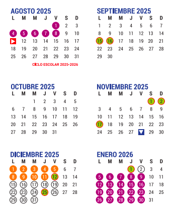

# Matemáticas Financieras 2026-1: Facultad de Ciencias, UNAM
## 11 de Agosto al 13 de Diciembre de 2025

**Profesor:** Eduardo Selim Martínez Mayorga (eduardo.selim@ciencias.unam.mx)

**Ayudante:** Eduardo Enrique Alanis Avila (eduardo.alanis@ciencias.unam.mx)

## Horario

+ Profesor: Martes, jueves y viernes de 8:00 a 9:00 hrs.
+ Ayudantías: Lunes y miércoles 8:00 a 9:00 hrs.

# Presentación 🚀

Esta es la primera asignatura del *core* actuarial (que se continuará en los cursos del área de finanzas y matemáticas actuariales), incluye el estudio de los conceptos de interés, tasa de interés (nominal, efectiva, real, fuerza de interés), valor presente y descuento, así como las relaciones existentes entre estos conceptos.

Gran parte del curso trabajará con el concepto de "anualidad", es por esto que se estudiará ampliamente. Asimismo, se hablará del término de ``ecuación de valor'' en el que se consideran algunas transacciones financieras sencillas y se resuelven problemas financieros (como valuaciones de bonos y proyectos de inversión) mediante el uso de esta noción.

Como parte de la aplicación de abstracciones asociadas a flujos de efectivo, el curso también tiene como objetivo proporcionar al estudiante los elementos para la elaboración de tablas que reflejen los distintos procesos de amortización, el planteamiento y solución de problemas involucrados con el concepto de depreciación. También se estudian los temas de tasas de rendimiento y reinversión.

La mayoría de los conceptos estudiados también se implementarán en en lenguaje de programación R (posit.co) como calculadora, graficador, optimizador y solver.

## Dinámica de las sesiones 🤓:
Las sesiones teóricas y prácticas se llevarán a cabo de manera síncrona de 8:00 a 9:00 de la mañana presencialmente (según las indicaciones de la Universidad). Toda comunicación e intercambio de archivos se llevará a cabo a través de Google Classroom (allí se distribuirán tareas, mensajes, notas de clase, etc). También se dejarán algunas lecturas y videos para reforzar lo visto durante la clase.\\

### Requisitos sugeridos:
Cálculo Diferencial e Integral II y Álgebra Superior II.

# T E M A R I O

# EVALUACIÓN 🎖
El curso será evaluado de la siguiente manera:

+ Tareas de casa grupales: En equipos de a los más 4 integrantes y cuyo valor será el 30\% de la calificación final. 8 tareas aproximadamente.
+ Laboratorios/Prácticas/Proyectos de R: En equipos de a los más 4 integrantes y cuyo valor será el 10\% de la calificación final. 2 prácticas aproximadamente.
+ Cuatro exámenes parciales: De manera individual en el salón de clases, cuyo valor es del 60\% de la calificación final
+ Habrá dos reposiciones y un examen final (el mismo día).
+ La escala de calificaciones en la siguiente:
[0,6)-5, [6, 6.6)-6, [6.6, 7.6)-7, [7.6, 8,6)-8, [8.6, 9.6)-9 y [9.6, 10)-10
+ No se cambia ninguna calificación por NP. No hay renuncias a calificaciones.

# ACLARACIONES

+ Las sesiones requieren asistencia plena, no sólo física.
+ Bajo ningún motivo se aceptarán tareas después de la fecha fijada de entrega.
+ No se realizarán exámenes extemporáneos por ningún motivo.
+ No se permiten teléfonos móviles encendidos y en consecuencia, queda prohibido salir del salón para contestar llamadas. En caso de hacerlo se retirará lo que resta de dicha sesión.
+ No se permite la entrada después de la hora más 10 minutos

# FORMA DE ENTREGA DE LAS TAREAS:
+ Se debe respetar el orden de las preguntas, y si no se contesta alguna, se debe escribir la pregunta y especificar que no se contestó. En caso de no ser así, no se revisará dicha tarea, obteniendo la calificación de cero en dicha tarea.
+ Limpieza y letra legible. Preferentemente en LaTeX o RMarkdown

# CALENDARIO

## Exámenes Parciales
+ Tema 1. Viernes 6 de Septiembre de 2025.
+ Tema 2. Viernes 11 de Octubre de 2025.
+ Tema 3. Jueves 31 de Octubre de 2025.
+ Tema 4. Viernes 22 de Noviembre de 2025.

## Examen final y Reposiciones

Fecha indicada por la División de Estudios Profesionales para el segundo periodo de exámenes finales (entre el 25 de Noviembre y 6 de Diciembre de 2025).
